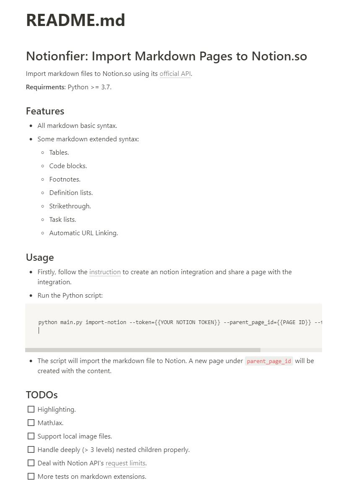

# Notionfier: Import Markdown Pages to Notion.so

Import markdown files to Notion.so using its [official API](https://developers.notion.com/).

**Requirments**: Python >= 3.7.

## Features
- All markdown basic syntax.
- Some markdown extended syntax:
  - Tables.
  - Code blocks.
  - Footnotes.
  - Definition lists.
  - Strikethrough.
  - Task lists.
  - Automatic URL Linking.


## Usage

- Firstly, follow the [instruction](https://developers.notion.com/docs/getting-started) to create an notion integration and share a page with the integration.
- Run the Python script:
```
python main.py import-notion --token={{YOUR NOTION TOKEN}} --parent_page_id={{PAGE ID}} --file_path={{FILE PATH}}
```
- The script will import the markdown file to Notion. A new page under `parent_page_id` will be created with the content.

For example, this `README.md` will look like this in Notion:



## TODOs
- [ ] Highlighting.
- [ ] MathJax.
- [ ] Support local image files.
- [ ] Handle deeply (> 3 levels) nested children properly.
- [ ] Deal with Notion API's [request limits](https://developers.notion.com/reference/request-limits).
- [ ] More tests on markdown extensions.

## LICENSE
[MIT License](https://opensource.org/licenses/MIT)